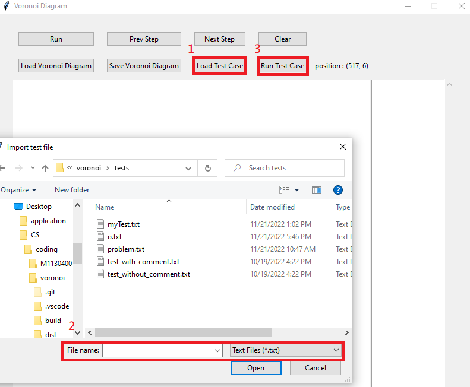
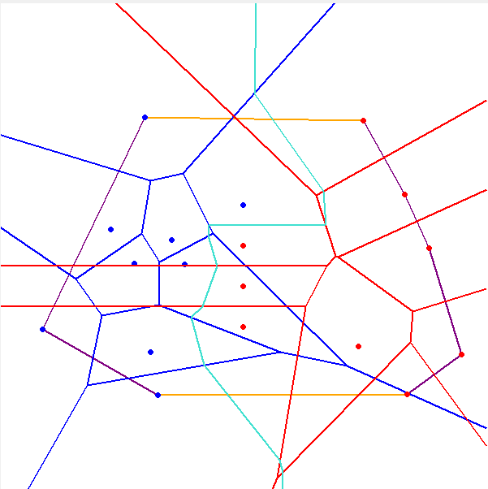
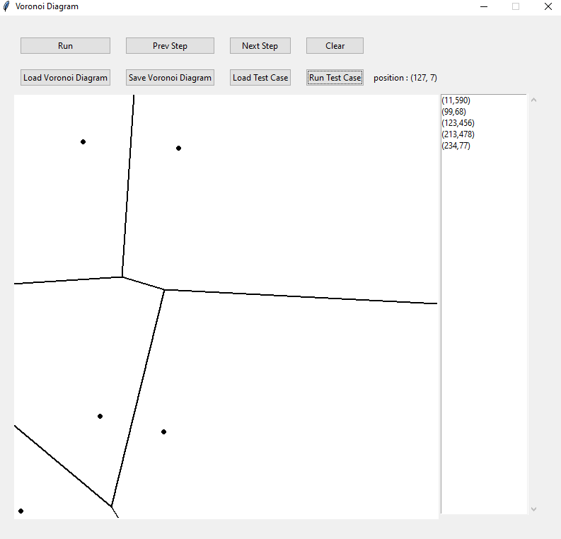
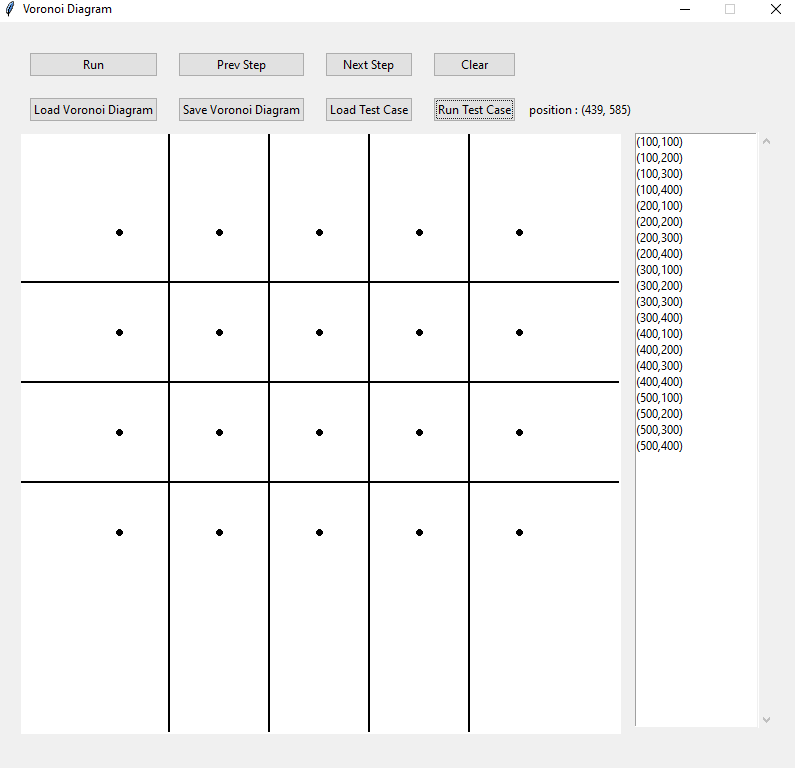
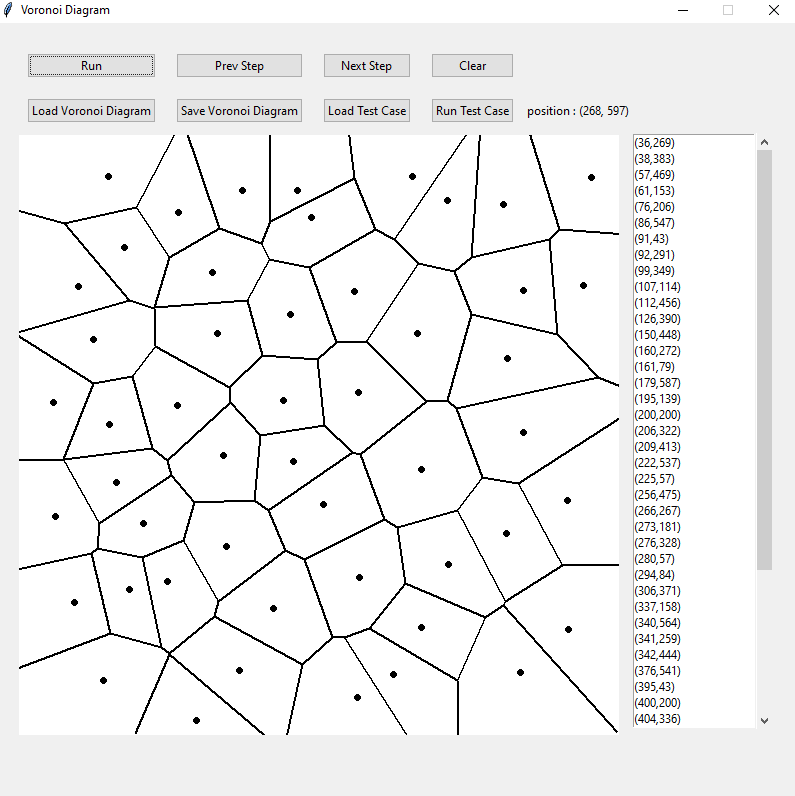

# Voronoi Diagram 期末報告
*   [Software Specification](#Software-Specification)
*   [Software Description](#Software-Description)
*   [System Design](#System-Design)
*   [Testing and Result](#testing-and-result)
*   [Appendix](#Appendix)

## Software Specification

### Input : 

* Click anywhere on the canvas using the mouse. The canvas size is 600.
* Use "Load Test Case" to load multiple sets of test data (each test data contains multiple points).
* The input format for each set of points starts with the total count, followed by the x-axis and y-axis of each point, as shown below:
    > 4
    > 
    > 103 200
    > 
    > 193 64
    > 
    > 193 370
    > 
    > 283 200
    > 
    > 5
    > 
    > 124 200
    > 
    > 244 260
    > 
    > 357 214
    > 
    > 457 537
    > 
    > 059 345

### Output：

* Click "Save Voronoi Diagram" to access the execution results.
* The output file format is as follows::

    * Output coordinates: P x y // Each point occupies one line, with two integers x and y representing the coordinates.

    * Segments: E x1 y1 x2 y2 // (x1, y1) is the starting point, and (x2, y2) is the ending point, where x1≤x2 or x1=x2, y1≤y2.

    * Coordinate points are arranged in the first half, and segments are arranged in the second half. Coordinate points are sorted in lexical order (i.e., first sorting by the first-dimensional coordinate, and if they are the same, then sorting by the second-dimensional coordinate; segments are also sorted in lexical order).

        > P 103 200
        > 
        > P 193 64
        > 
        > P 193 370
        > 
        > P 283 200
        > 
        > E 0 34 193 161
        > 
        > E 0 363 193 261
        > 
        > E 193 161 193 261
        > 
        > E 193 161 437 0
        > 
        > E 193 261 600 476

### Main Interface

### Functions : 

* Run:

    透過滑鼠產生點，執行Run即可產生對應的Voronoi Diagram。
    
* Prev Step:

    透過step by step的方式產生下一步merge的畫面。
    
* Next Step:

    透過step by step的方式產生前一步merge的畫面。
    
* Clear:

    將目前畫面及所產生的資料清除。
    
* Load Voronoi Diagram:

    將產生的Voronoi Diagram匯出(包含線段及點)。
    
* Sava Voronoi Diagram:

    將產生的Voronoi Diagram匯出(包含線段及點)。
    
* Load Test Case:

    將多組Test Cases匯入(每組包含多個點)。
    
* Run Test Case:

    透過此按鍵依序執行匯入的多組Test Cases。

## Software Description

* Installation Instructions

    After downloading the file, simply run "voronoi.exe" in a Windows environment.

* Usage Instructions
    1. Draw points on the canvas, then execute by clicking "Run".
    

    2. Import a test case and execute each test case sequentially by clicking "Run Test Case."
    

    3. When there are points on the screen, you can use "Prev Step" and "Next Step" to view the merge steps of this Voronoi Diagram (Blue: left Voronoi; Red: right Voronoi; Green: hyperplane; Purple: convex hull; Orange: upper/lower tangent).
    
    

    4. After execution is complete, you can export the Voronoi Diagram using "Save Voronoi Diagram" and load previously saved files using "Load Voronoi Diagram" in the future.
    
    

## System Design

### 資料結構

* Point
    
    > x: float
    > 
    > y: float
    > 
    > edges: list\[Edge\] #用來記錄目前這個交點與哪幾條Edge相連，在消線時使用
    
*   Line
    
    以方程式ax+by=c的方式分別記錄xCoefficient, y Coefficient及constant
    
    > 以方程式ax+by=c的方式做紀錄，用來計算交點
    > 
    > xCoefficient: float
    > 
    > yCoefficient: float
    > 
    > constant: float
    
*   Face
    
    Voronoi Diagram中被線段圍起的點
    
    > point: Point
    > 
    > edges: list\[Edge\] #關聯所有包為此點的線段
    
*   Edge
    
    > start: Point
    > 
    > end: Point
    > 
    > startInfinity: bool # 紀錄此線段在途中是否為無限延伸
    > 
    > endInfinity: bool
    > 
    > twinEdge: 'Edge' # 每個線段都有2條，其起點與終點剛好相反
    > 
    > line: 'Line' # 線段方程式，用來找交點
    > 
    > face: 'Face' # 線段關聯到其對應的Face
    
*   VoronoiGraph
    
    > canvasWidth: int
    > 
    > canvasHeight: int
    > 
    > faces: list\[Face\] # 紀錄voronoi graph中所有的face
    > 
    > edges: list\[Edge\] # 紀錄voronoi graph中所有的edge。目前尚未使用。
    > 
    > voronoiPoints: list\[Point\] # 紀錄voronoi graph中線段的交點。目前尚未使用。
    > 
    > convexHull: list\[Point\] # 紀錄目前voronoi graph中的convexhull(逆時針)
    > 
    > mergeRecords: list\[MergeRecord\] # step by step的執行紀錄
    

Algorithm

*   Merge 2 Convex hull O(n)
    > 1. Set the rightmost point of the left convex hull as lPoint and the leftmost point of the right convex hull as rPoint, using these two points as the reference edge.
    >
    > 2. Start with lPoint as the reference and find the upper point with respect to rPoint. Create a new line segment with lPoint and this point and check if the new line segment rotates counterclockwise in comparison to the original line segment. If it does, use this new line segment as the reference and continue upward until the reference line segment and the new line segment become clockwise, indicating the topmost point on the right side.
    >
    > 3. Start with the rPoint found in step 2 as the reference and find the upper point with respect to lPoint. Create a new line segment with rPoint and this point and check if the line segment rotates clockwise. If it does, use this new line segment as the reference and continue upward until the reference line segment and the new line segment become counterclockwise, indicating the topmost point on the left side.
    >
    > 4. Steps 2 and 3 do not guarantee finding the upper tangents of both convex hulls, so repeat steps 2 and 3 until the points on both sides no longer change, indicating that the upper tangents have been found.
    >
    > 5. Finding the lower tangents follows the same method.
    >
    > 6. Combine the upper and lower tangents with the original left and right convex hulls to create a new convex hull.
    
*   Find Hyperplane O(n)(線段最多3n-6，此演算法每找一個切點會將face往下移，所以不會重複尋找線段)

    > 1. Use the upper tangent found from the convex hull as the reference. The points on the left side are referred to as the left face, and the points on the right side are referred to as the right face. Use these two points to find the perpendicular bisector.
    > 
    > 2. Find the intersection of this perpendicular bisector with the line segments enclosing the left face and the right face. Locate the first intersecting line segment with the perpendicular bisector, and the intersection point becomes the endpoint of this bisector and the starting point of the next bisector.
    > 
    > 3. If the intersecting line segment is on the left side, set the left face as the face opposite to this line segment. If the intersecting line segment is on the right side, set the right face as the face opposite to this line segment.
    > 
    > 4. Repeat steps 2 and 3 until the left face and right face are the endpoints of the lower tangent.
    > 
    > 5. Reset the endpoints of the intersecting line segments from step 2 to the intersection points. Due to the reduction in line segments, it's necessary to delete the original line segments connected to these endpoints (determined by checking whether the line segments are counterclockwise or clockwise and whether they belong to the left or right side of Voronoi).
    > 
    > 6. Since step 5 only deletes line segments directly connected to the reduced line segment endpoints, scan all line segments to check if their endpoints only reference themselves. If so, it means these line segments are not connected to any other line segments and can be deleted (endpoints that extend infinitely will only reference their own line segment and should not be deleted).
    

## Testing and Result

### Test Environment
Operating System: Windows 10 Pro (Version: 21H1)
Processor: 11th Gen Intel(R) Core(TM) i5-1135G7 @ 2.40GHz 1.38 GHz
RAM: 24.0 GB
Programming Language: Python 3.10.7

### Experimental Results
       

## Appendix

[執行檔](./voronoi.exe) [原始程式碼1](./src/main.py) [原始程式碼2](./src/voronoi.py) [測資](./test/test_case.txt)
